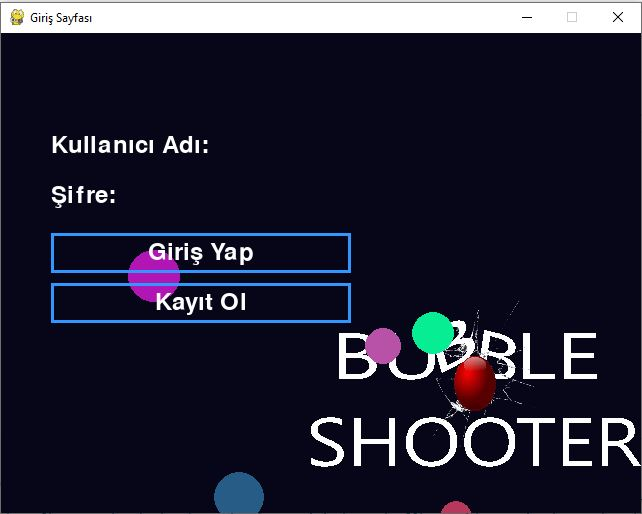
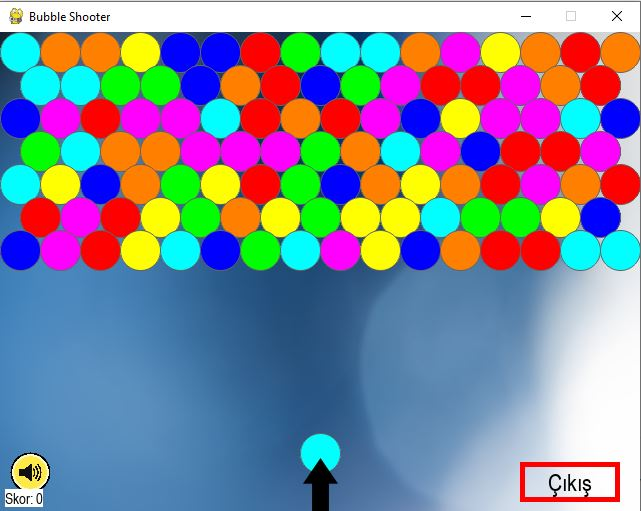
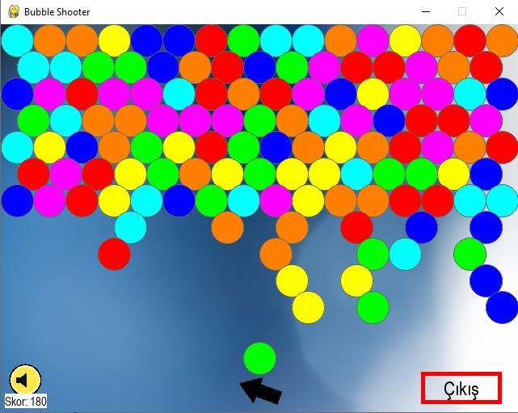
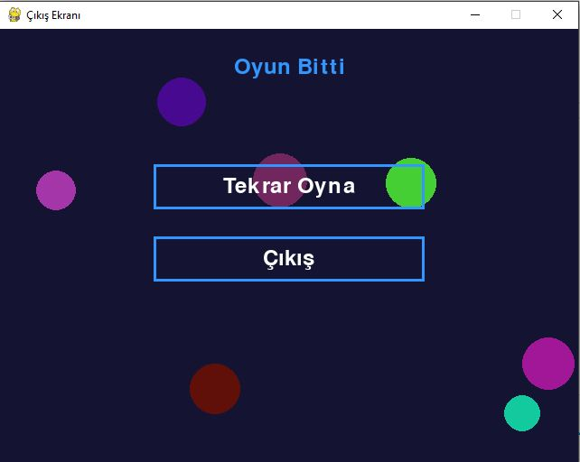

# 🎮 Bubble Shooter – Pygame Edition

Python ve Pygame kullanılarak geliştirilmiş eğlenceli bir Bubble Shooter oyunudur. 
Oyuncu, aynı renkteki baloncukları nişan alıp patlatarak puan kazanır. 
Oyun; **Giriş Ekranı → Oyun Sayfası → Skor/Çıkış Ekranı** şeklinde ilerler.

---

## 📸 Ekran Görüntüleri

### 🟦 Giriş Ekranı


### 🟩 Oyun Sayfası


### 🟩 Oyun Sayfası 


### 🟥 Skor / Çıkış Ekranı


---

## 🚀 Oyunu Çalıştırmak İçin

```bash
pip install pygame
python main.py
